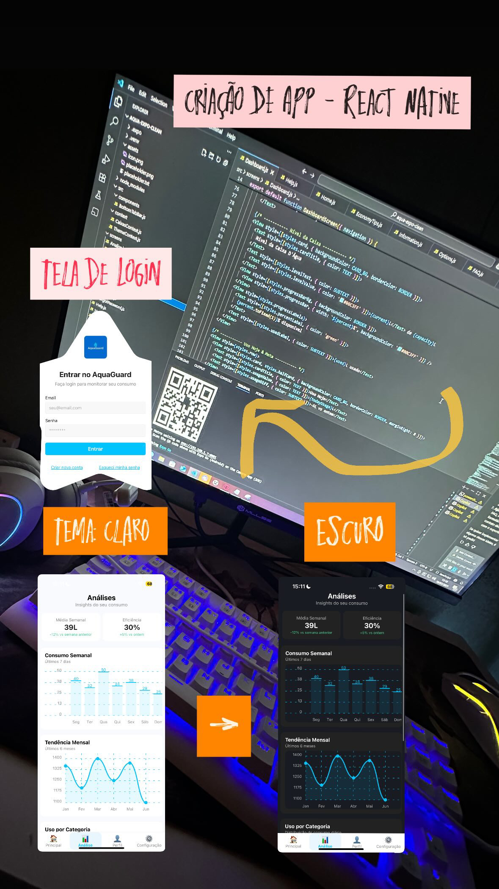

<div align="center">

# 💧 AquaGuard

### Monitoramento Inteligente de Água em Tempo Real

[](https://www.figma.com/design/E1DOlAAqGxfsNUSdUMuM6L/Prot%C3%B3tipo---AquaGuard?node-id=0-1&p=f&t=808FO5iqxMpMaPWB-0)
[](https://www.oracle.com/java/)
[](https://spring.io/projects/spring-boot)
[](https://expo.dev/)



**Monitoramento em tempo real · Análise de consumo · Alertas inteligentes**

[Características](#-características-principais) • [Tecnologias](#-tecnologias) • [Instalação](#-instalação) • [API](#-api-endpoints) • [Autores](#-autores)

</div>

---

## 📖 Sobre o Projeto

O **AquaGuard** é uma solução completa de IoT para monitoramento inteligente de caixas d'água, oferecendo controle total sobre o consumo de água através de dados precisos e insights acionáveis. O sistema combina hardware embarcado, backend robusto e aplicativo móvel intuitivo para transformar a gestão de água.

### 🎯 O Problema

- 💸 Desperdício significativo de água por falta de visibilidade
- 🚰 Vazamentos não detectados aumentando custos
- 📊 Ausência de dados para entender padrões de consumo
- ⚠️ Contas de água inesperadamente altas

### 💡 Nossa Solução

Um ecossistema completo que conecta dispositivo IoT + API + App móvel para:

- 📱 **Monitoramento em Tempo Real** - Acompanhe o nível da sua caixa d'água de qualquer lugar
- 📊 **Análise Avançada** - Gráficos e relatórios detalhados do seu consumo
- 🎯 **Metas Inteligentes** - Configure e acompanhe metas de economia
- 🔔 **Alertas Automáticos** - Notificações sobre vazamentos e níveis baixos
- 🔒 **Segurança Total** - Autenticação JWT e criptografia de dados

---

## ✨ Características Principais

### 📱 Aplicativo Mobile (React Native + Expo)

- ✅ Dashboard intuitivo com status em tempo real
- ✅ Gráficos interativos de consumo histórico
- ✅ Sistema de metas personalizadas (diário/semanal/mensal)
- ✅ Gerenciamento de múltiplos dispositivos
- ✅ Notificações push configuráveis
- ✅ Perfil de usuário completo
- ✅ Modo offline com sincronização automática

### 🖥️ Backend API (Java + Spring Boot)

- ✅ API RESTful com documentação completa
- ✅ Autenticação JWT segura
- ✅ Sistema HMAC para comunicação com dispositivos
- ✅ Banco de dados persistente H2/MySQL
- ✅ Migrações automáticas com Flyway
- ✅ Soft delete para preservar histórico
- ✅ Análise de consumo com períodos customizados
- ✅ Sistema de verificação de email

### ⚙️ Hardware Embarcado

- ✅ Medição precisa de volume de água
- ✅ Comunicação segura via HTTPS + HMAC
- ✅ Configuração de frequência de atualização
- ✅ Baixo consumo de energia
- ✅ [Repositório do Sistema Embarcado →](https://github.com/Leonardobrzz/Water-Level-Monitoring)

---

## 🛠️ Tecnologias

<table>
<tr>
<td valign="top" width="33%">

### Backend
- Java 21
- Spring Boot 3.5
- Spring Security
- Spring Data JPA
- Flyway Migrations
- JWT Authentication
- H2/MySQL Database
- Maven

</td>
<td valign="top" width="33%">

### Mobile
- React Native
- Expo
- TypeScript
- Expo Router
- AsyncStorage
- Expo Notifications
- React Navigation

</td>
<td valign="top" width="33%">

### Embarcado
- ESP32/Arduino
- Sensor Ultrassônico
- HTTPS/TLS
- HMAC SHA-256
- WiFi Manager

</td>
</tr>
</table>

---

## 🚀 Instalação

### Pré-requisitos

- **Java 21** ou superior
- **Node.js 18+** e npm/yarn
- **Maven** (ou usar o wrapper incluído)
- **MySQL** (opcional - H2 incluído para desenvolvimento)
- **Expo Go** app no celular (para testar o mobile)

### 📦 Backend API

```bash
# Clone o repositório
git clone https://github.com/gabrielbmonteiro/AquaGuard.git
cd AquaGuard/aquaguard-api

# Execute com banco H2 persistente (recomendado para desenvolvimento)
./start-backend-persistent.cmd

# Ou compile e execute manualmente
mvn clean install
java -jar target/aquaguard-api-0.0.1-SNAPSHOT.jar \
  --spring.profiles.active=dev \
  --spring.datasource.url="jdbc:h2:file:C:/temp/aquaguard_dev" \
  --spring.jpa.hibernate.ddl-auto=update
```

A API estará disponível em: **http://localhost:8080**

Console H2: **http://localhost:8080/h2-console**
- JDBC URL: `jdbc:h2:file:C:/temp/aquaguard_dev`
- Username: `sa`
- Password: *(deixe em branco)*

### 📱 Aplicativo Mobile

```bash
# Navegue para o diretório mobile
cd aquaguard-mobile-new

# Instale as dependências
npm install

# Inicie o Expo
npm start
# ou
npx expo start

# Escaneie o QR code com o Expo Go (Android/iOS)
```

**Configuração da API**: Edite `services/apiConfig.ts` para apontar para seu backend:

```typescript
export const API_BASE_URL = 'http://SEU-IP:8080/api/v1';
```

---

## 🔌 API Endpoints

### 🔐 Autenticação (`/api/v1/auth`)

| Método | Endpoint | Descrição | Auth |
|--------|----------|-----------|------|
| `POST` | `/register` | Registrar novo usuário | Público |
| `POST` | `/login` | Login e obter token JWT | Público |
| `POST` | `/verify` | Verificar email com código | Público |
| `POST` | `/resend-code` | Reenviar código de verificação | Público |

### 👤 Usuários (`/api/v1/users`)

| Método | Endpoint | Descrição | Auth |
|--------|----------|-----------|------|
| `GET` | `/me` | Obter perfil do usuário | JWT |
| `PUT` | `/me/profile` | Atualizar perfil | JWT |
| `PUT` | `/me/password` | Alterar senha | JWT |
| `POST` | `/me/change-email` | Iniciar alteração de email | JWT |
| `POST` | `/me/verify-email-change` | Confirmar novo email | JWT |
| `POST` | `/me/devices` | Registrar dispositivo push | JWT |
| `DELETE` | `/me` | Desativar conta | JWT |

### 💧 Caixas D'água (`/api/v1/caixas-dagua`)

| Método | Endpoint | Descrição | Auth |
|--------|----------|-----------|------|
| `GET` | `/` | Listar todas as caixas | JWT |
| `GET` | `/{id}` | Detalhes de uma caixa | JWT |
| `GET` | `/{id}/analise` | Análise de consumo | JWT |
| `POST` | `/parear-dispositivo` | Parear novo dispositivo | JWT |
| `PUT` | `/{id}` | Atualizar configurações | JWT |
| `DELETE` | `/{id}` | Desativar caixa d'água | JWT |

### 📊 Leituras (`/api/v1/leituras`)

| Método | Endpoint | Descrição | Auth |
|--------|----------|-----------|------|
| `POST` | `/` | Registrar nova leitura | HMAC |

### ⚙️ Provisionamento (`/api/v1/provisionamento`)

| Método | Endpoint | Descrição | Auth |
|--------|----------|-----------|------|
| `GET` | `/configuracao/{serialNumber}` | Obter configurações do dispositivo | HMAC |

---


## 🔒 Segurança

- **JWT Tokens** com expiração configurável
- **HMAC SHA-256** para autenticação de dispositivos
- **Bcrypt** para hash de senhas
- **Soft Delete** para preservar histórico de dados
- **Validação de entrada** em todos os endpoints
- **CORS configurado** para ambiente de desenvolvimento

---

## 🤝 Como Contribuir

1. Faça um Fork do projeto
2. Crie uma branch para sua feature (`git checkout -b feature/AmazingFeature`)
3. Commit suas mudanças (`git commit -m 'Add some AmazingFeature'`)
4. Push para a branch (`git push origin feature/AmazingFeature`)
5. Abra um Pull Request

---

## 📝 Licença

Este projeto está sob a licença MIT. Veja o arquivo [LICENSE](LICENSE) para mais detalhes.

---


---

## 🔗 Links Relacionados

- [Protótipo no Figma](https://www.figma.com/design/E1DOlAAqGxfsNUSdUMuM6L/Prot%C3%B3tipo---AquaGuard?node-id=0-1&p=f&t=808FO5iqxMpMaPWB-0)
- [Repositório do Sistema Embarcado](https://github.com/Leonardobrzz/Water-Level-Monitoring)
- [Documentação da API](http://localhost:8080/swagger-ui.html) *(quando rodando localmente)*

---
